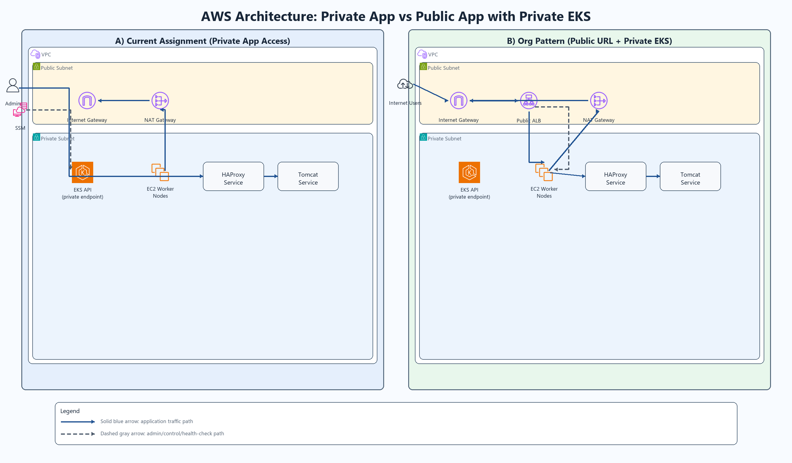

# AWS DevOps Technical Assessment

  Private EKS infrastructure project with clear private-access and public-access architecture patterns.

  

## Project Snapshot

This repository demonstrates how to build a production-style Amazon EKS environment using Terraform modules, with Kubernetes workloads deployed in private networking by default.

It also explains a common enterprise pattern:
- Keep EKS control plane private
- Keep worker nodes private
- Expose application publicly only through a managed load balancer when required

## What This Project Builds

| Area | Implementation |
|---|---|
| Infrastructure as Code | Terraform modular structure (`vpc`, `eks`, `nodegroup`) |
| Kubernetes Platform | EKS cluster with managed worker node group |
| Networking | VPC with public and private subnets, IGW and NAT |
| Security Posture | Private EKS API endpoint and private worker nodes |
| Application Layer | HAProxy and Tomcat deployed in Kubernetes |
| Operational Access | SSM-based secure admin access pattern |

## Private vs Public Architecture (Simple Explanation)

### Private application model
- Application is internal-only inside Kubernetes networking.
- Services are `ClusterIP` and not directly internet reachable.
- Admin access is from inside VPC boundary (for example via SSM session).
- Best for internal tools, compliance workloads, and restricted environments.

### Public application model
- EKS control plane and nodes can still remain private.
- Public entrypoint is a controlled ALB/NLB in public subnet.
- Traffic flows from Internet to load balancer, then to private targets.
- Best for customer-facing apps with strong perimeter control.

## Why This Repository Is Useful

- Shows real interview-grade separation between control plane privacy and application exposure.
- Demonstrates secure-by-default infrastructure decisions.
- Keeps implementation organized and reusable through Terraform modules.
- Includes practical documentation for setup, validation, and SSH-free admin access.

## Documentation Guide

- Setup and deployment runbook: [docs/STEP_BY_STEP.md](docs/STEP_BY_STEP.md)
- Private node access approach: [docs/ssh-access.md](docs/ssh-access.md)
- Architecture narrative and diagrams: [docs/ARCHITECTURE_DIAGRAM.md](docs/ARCHITECTURE_DIAGRAM.md)

## Repository Structure

- `terraform/` infrastructure modules and root configuration
- `kubernetes/` workload manifests and supporting policies
- `docs/` diagrams, runbook, and operational notes

## Final Notes

This project is intentionally designed for clarity and learning:
- Security-first private EKS baseline
- Clean path to public application exposure when needed
- Documentation that helps explain architecture to technical and non-technical stakeholders
