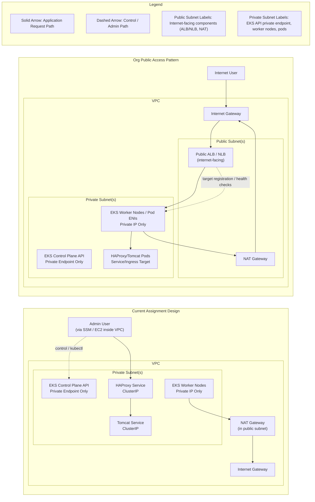

# Architecture Diagram: Private EKS vs Public LB Pattern

This diagram compares:
1. Current assignment design (private-only access path)
2. Organization pattern (public app URL with private EKS cluster)

## AWS Logo Diagram (Image)


Generated from official AWS Architecture Icons using:

```bash
python docs/scripts/generate_aws_logo_diagram.py
```

## Public Application vs Your Private Application

- Your cluster API is private-only (`endpoint_private_access = true`, `endpoint_public_access = false`), so Kubernetes control plane is not internet-exposed.
- Your current app exposure is private because `haproxy-service` is `ClusterIP`, which gives internal cluster access only.
- Your worker nodes are in private subnets; they do not need public IPs for inbound user traffic.
- Public subnet + NAT exists mainly for outbound traffic from private resources (for example image pulls), not as a public app entrypoint in your current setup.
- In the org pattern, a public ALB/NLB in public subnet is the internet entrypoint and forwards traffic to private targets (nodes/pods), so app can be public while cluster remains private.



## How to Read This Diagram

- In both designs, the EKS control plane API is private-only (`endpoint_public_access = false`).
- In your current assignment design, there is no internet-facing load balancer and app service is `ClusterIP`, so no public URL exists.
- Admin access happens from inside the VPC boundary (for example, SSM session on EC2), then traffic goes to internal Kubernetes services.
- NAT in public subnet is for outbound internet access from private resources (image pulls, updates), not inbound public app traffic.
- In the org pattern, only the ALB/NLB is public; worker nodes and pods remain in private subnets.
- Public users reach the app through ALB/NLB, which forwards to private targets (nodes/pods), preserving private cluster/network posture.
- This is why a cluster can be private and still serve a public application URL safely.
